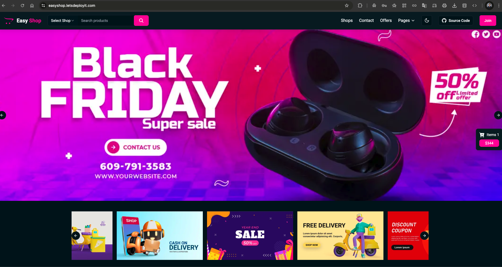

# 🛍️ EasyShop — Modern E-commerce Platform

<div align="center">

[](https://nextjs.org/)
[](https://www.typescriptlang.org/)
[](https://www.mongodb.com/)
[](https://redux.js.org/)
[](https://www.docker.com/)
[](https://kubernetes.io/)
[](LICENSE)

A production-grade, full-stack e-commerce platform with a complete CI/CD pipeline on AWS EKS.



</div>

---

## ✨ Features

| Feature | Details |
|---|---|
| 🎨 Responsive UI | Dark/Light mode, mobile-first with Tailwind CSS |
| 🔐 Auth | Secure JWT + NextAuth session management |
| 🛒 Cart | Real-time cart state via Redux Toolkit |
| 🔍 Search | Advanced product search and category filtering |
| 💳 Checkout | Multi-step checkout flow |
| 👤 Profiles | User accounts with order history |
| 📦 Categories | Electronics, Grocery, Clothing, Furniture, Beauty & more |

---

## 🏗️ Architecture

EasyShop uses a classic three-tier architecture, fully containerised and deployed on Kubernetes.

```
┌─────────────────────────────────────────────┐
│            Presentation Tier                │
│  Next.js Components · Redux · Tailwind CSS  │
└───────────────────┬─────────────────────────┘
                    │ HTTP
┌───────────────────▼─────────────────────────┐
│             Application Tier                │
│  Next.js API Routes · Auth · Business Logic │
└───────────────────┬─────────────────────────┘
                    │ Mongoose ODM
┌───────────────────▼─────────────────────────┐
│               Data Tier                     │
│          MongoDB · CRUD · Validation        │
└─────────────────────────────────────────────┘
```

---

## 🚀 Tech Stack

### Application
[](https://nextjs.org/)
[](https://react.dev/)
[](https://www.typescriptlang.org/)
[](https://www.mongodb.com/)
[](https://redux.js.org/)
[](https://tailwindcss.com/)

### Infrastructure & CI/CD
[](https://aws.amazon.com/)
[](https://www.terraform.io/)
[](https://www.docker.com/)
[](https://kubernetes.io/)
[](https://www.jenkins.io/)
[](https://argoproj.github.io/cd/)
[](https://aquasecurity.github.io/trivy/)

---

## 📦 Project Structure

```
easyshop/
├── src/
│   ├── app/              # Next.js App Router pages & layouts
│   ├── components/       # Reusable React components
│   └── lib/
│       ├── auth/         # NextAuth + JWT logic
│       ├── db/           # Mongoose connection
│       └── features/     # Redux slices
├── kubernetes/           # K8s manifests (namespace → ingress)
├── terraform/            # IaC for VPC, EKS, EC2 (Jenkins)
├── scripts/              # DB migration (ts-node + Docker)
├── Dockerfile            # Multi-stage production build
├── docker-compose.yml    # Local dev stack
└── Jenkinsfile           # CI pipeline (Shared Library)
```

---

## ⚡ Quick Start (Local — Docker Compose)

```bash
# 1. Clone
git clone https://github.com/rohandeb2/Easy-shop-E-commerce.git
cd Easy-shop-E-commerce

# 2. Create .env.local
cp .env .env.local
# Edit NEXTAUTH_SECRET and JWT_SECRET:
openssl rand -base64 32   # → NEXTAUTH_SECRET
openssl rand -hex 32      # → JWT_SECRET

# 3. Run
docker compose up -d

# 4. Open
open http://localhost:3000
```

> See [DEPLOYMENT.md](DEPLOYMENT.md) for the full AWS EKS production deployment guide.

---

## 🔧 Troubleshooting

**MongoDB not reachable**
```bash
docker ps
docker logs easyshop-mongodb
docker network inspect easyshop-network
```

**Build errors / strange behaviour**
```bash
rm -rf .next
npm install
docker compose down -v && docker compose up -d
```

---

## 🤝 Contributing

1. Fork the repository
2. Create a branch: `git checkout -b feature/my-feature`
3. Commit: `git commit -m 'feat: add my feature'`
4. Push: `git push origin feature/my-feature`
5. Open a Pull Request

---

<div align="center">
  Made with ❤️ by <a href="https://github.com/rohandeb2"><b>Ruhon Deb</b></a>
  &nbsp;·&nbsp;
  <a href="DEPLOYMENT.md">📖 Full Deployment Guide</a>
</div>
